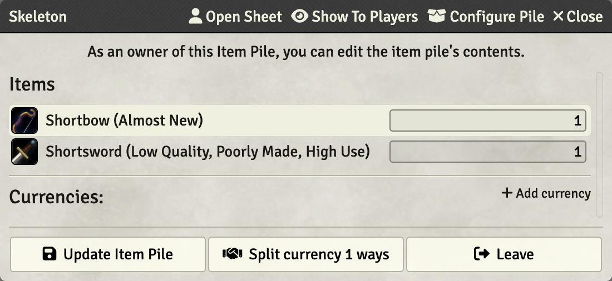
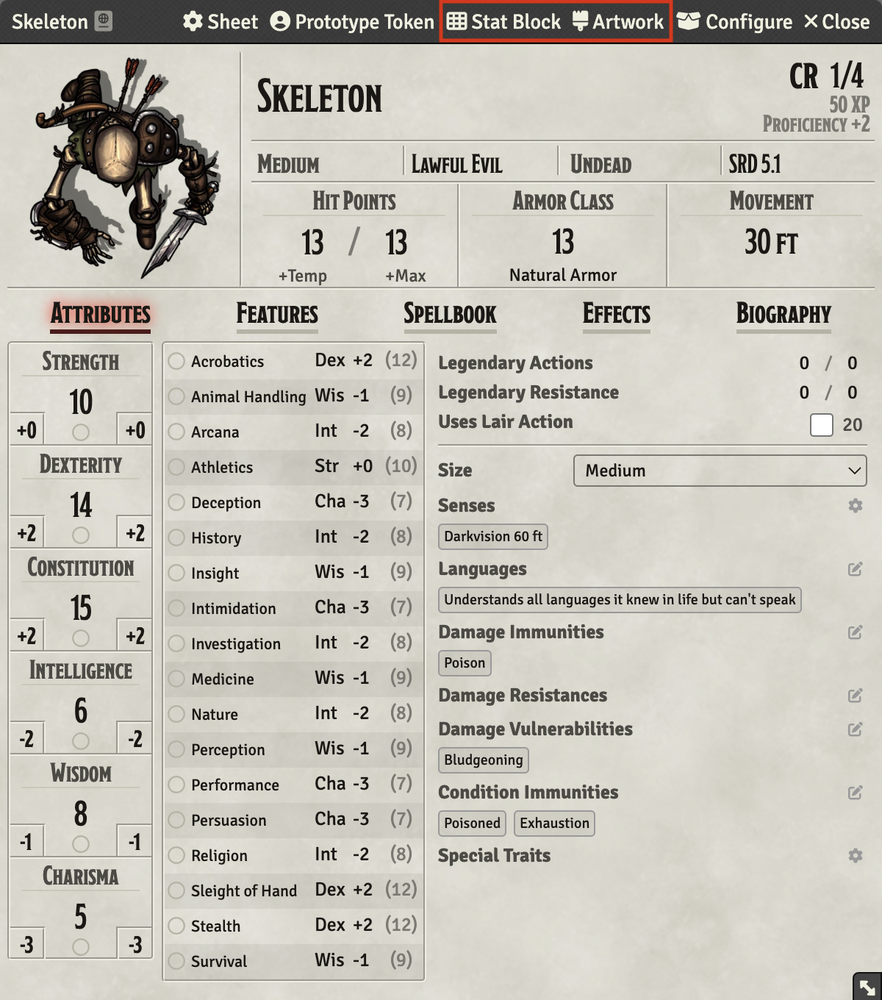
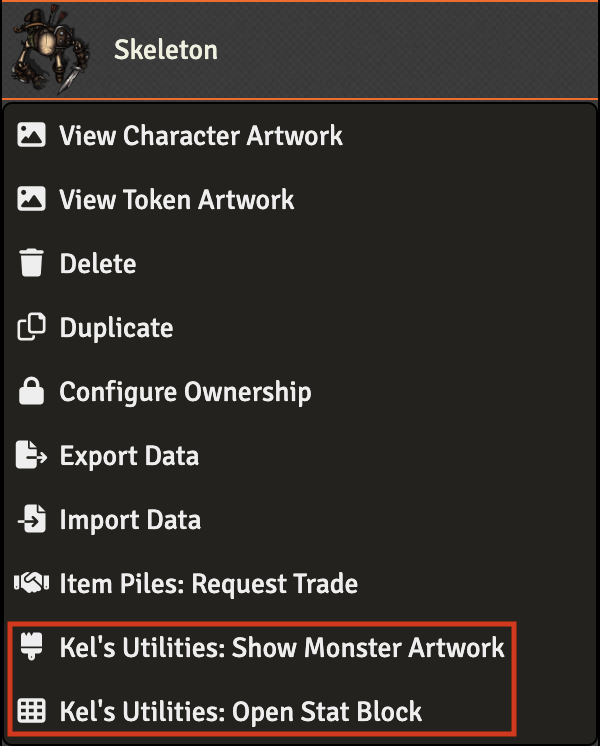

  

# Kel's Utilities

A [Foundry VTT](https://foundryvtt.com) module containing various utilities I wrote to improve the gameplay.

## Equipment Quality

This module implements support for equipment (item) quality to [Item Piles](https://github.com/fantasycalendar/FoundryVTT-ItemPiles).

When a token is turned into an *Item Pile*, the quality of its items is modified by randomly changing the item name and its price as a function of the *Equipment Quality* roll table from [Thieve's Guild](https://www.thievesguild.cc/harvest/creature.php?id=1#tab4):

| D100    | % Chance | Quality                              | Value |
|---------|----------|--------------------------------------|-------|
| 1-2     | 2%       | Superb                               | 1.5×  |
| 3-5     | 3%       | Almost New                           | 1×    |
| 6-55    | 50%      | Low Quality (Poorly Made, High Use)  | 0.5×  |
| 56-65   | 10%      | Terrible Quality (Cracked, Warped)   | 0.1×  |
| 66-100  | 35%      | Destroyed                            | 0×    |

## Monster Artwork and Statblock

This module adds new actions and context menu entries to the *NPC* sheets that allows showing to the players available online monsters artwork or opening their stat blocks in the browser.

The current resource urls are sourced from [DnD Beyond - Monsters](https://www.dndbeyond.com/monsters)

The [dndbeyond_monster_resources.py](utilities/dndbeyond_monster_resources.py) Python script can be used to update the resource urls.

## Miscellaneous

My theme for [lib-themer](https://github.com/mouse0270/lib-themer) is available along with its companion stylesheet file in the [themes](themes/) directory.

# About

**Kel's Utilities** by Thomas Mansencal

Copyright 2023 Thomas Mansencal

This software is released under terms of MIT License: https://opensource.org/licenses/MIT
